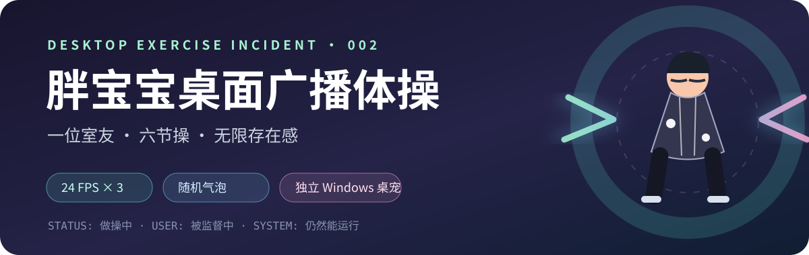
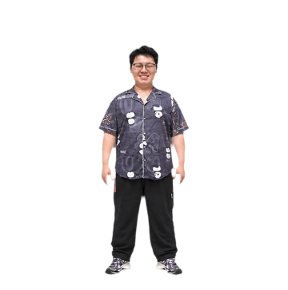
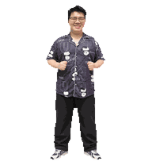
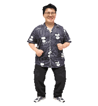
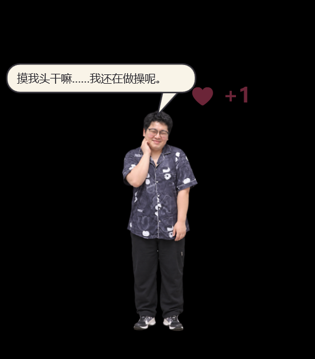

<p align="center">
  
</p>

<h1 align="center">胖宝宝独立桌宠</h1>

<p align="center">一位本该休息的舍友，开始在你的 Windows 桌面认真做广播体操。<br />你摸他的头，他会冒爱心、害羞一下；练着练着，还可能突然开口。</p>

<p align="center">
  <a href="https://github.com/Left-William/pangbaobao-desktop-pet/releases/tag/v0.3.0-preview.1">⬇️ 下载桌宠</a>
  · <a href="#先看节目再请上桌">🎬 看动作</a>
  · <a href="#三分钟上桌">🚀 安装</a>
  · <a href="docs/0.5-实施记录.md">🔬 看 0.5 进度</a>
  · <a href="docs/0.5-工程规划.md">📐 看 0.5 规划</a>
</p>

> **桌面健康提示**：他做操的目的暂时不明，但你确实已经坐太久了。

## 这是什么情况

这是一个**独立 Windows 桌面程序**。人物以透明窗口悬浮在桌面上，可以拖动、缩放、置顶；默认循环播放六节广播体操。右键可以固定某一节，也能让他暂停。系统托盘里有设置和退出入口。

人物参考了用户提供的舍友照片。仓库公开下载仍是 **0.3.0-preview.1**；当前工作区正在制作 **0.5.0-preview.1**，新增睡衣／黑 T 恤切换、可自行配置的兼容对话 API 和项目化构建入口。两套站立母版已获“基本像，可继续”反馈；边缘质量与高强度动作仍在视觉验收中，具体差距见 [实施记录](docs/0.5-实施记录.md)。

### 0.5 开发预览里的服装和对话

右键 **「服装」** 可在印花睡衣与黑 T 恤之间切换。当前若在播一次性动作，切换会等动作结束后生效。黑 T 恤下提供站立、单节伸展、点击娇羞、跳高与跳远的关键姿势预览；睡衣仍以广播体操为主。两套服装的全部动作尚未达到相同覆盖度和清晰度，因此 0.5 还不是正式发布。

桌宠下方的 **💬 图标** 可展开对话框，直接发送消息、设置兼容 chat completions 的完整 HTTPS 端点、模型和密钥，也可编辑独立人设。点击「−」收起；聊天闲置 2 分钟、配置页闲置 5 分钟会自动缩回图标。屏幕下方空间不足时，对话框会优先挪动桌宠，仍放不下就贴在侧边。密钥使用 Windows 当前用户 DPAPI 加密保存在本机；未配置外部服务时使用本地台词。默认只在你手动发送或测试连接时调用外部服务；你也可以单独开启有次数上限的自动气泡回复。程序不会上传参考照片或屏幕内容。接口对不同供应商的兼容范围须用你填写的真实 API 再测。

### 他的日程安排

| 节目 | 播放帧 | 桌面观察报告 |
| :--- | ---: | :--- |
| 伸展 | 18 帧 · 变速停顿 | 双手缓慢升天，工位气压略有变化 |
| 扩胸 | 6 帧 | 对着空气办了一张健身卡 |
| 体前屈 | 6 帧 | 试图确认地板是否仍在原位 |
| 转体 | 12 帧 · 变速停顿 | 检查你有没有偷偷摸鱼 |
| 踮脚 | 12 帧 · 变速停顿 | 临时申请增加一点身高 |
| 侧弯 | 6 帧 | 与地心引力进行友好协商 |

伸展、转体、踮脚各有一套**原版对照动作**，可在右键菜单中单独循环；默认整套广播体操只播放上表六节。

## 先看节目，再请上桌

<p align="center">
  
  
  
</p>

这三节从 0.2 的离线 RIFE 补帧中挑选过渡姿势，给起势、到位和收势分别设定停留时间。原来的 24 FPS 图仍留在仓库中作对照；运行时不调用 RIFE。少数人物纹理仍可能随姿势变化，欢迎先看预览再决定是否升级。

## 摸头会怎样

轻点头部，他会冒出爱心并做一个短暂的娇羞动作。点击和有效拖动分别增加好感度，连点有冷却，每分钟也有计分上限。好感度到 **30** 首次触发飞吻，到 **70** 首次触发打滚；以后互动时有小概率再演，广播体操仍是默认节目。右键可查看进度、预览动作或重置进度。进度保存在 `%APPDATA%\PangBaoBaoPet\pet-state.json`，与气泡设置分开。

<p align="center"></p>

## 他什么时候开口

他会不定时弹出对话气泡，文案由你设置。默认台词包括：

> 做操呢，别盯着我看。
>
> 你也起来活动两下。
>
> 先别吵，正在扩胸。

现在是带尾巴的漫画对白框，会跟着人物头部定位。右键进入 **「设置对话与互动…」**，可编辑日常、摸头、拖动、飞吻和打滚的台词，逐条启停；随机出现概率与互动后出现概率分别可调。默认每 **300 秒**判定一次日常对白，命中概率 **20%**，气泡显示 **5 秒**，消失后冷却 **600 秒**。随机概率设为 **0%** 不影响飞吻和打滚的首次奖励。双击人物或选择 **「预览一条气泡」** 可立即预览。

<p align="center"></p>

设置保存在 `%APPDATA%\PangBaoBaoPet\settings.json`，更新时保留 `.bak` 备份。需要便携配置时，可在启动前设置环境变量 `PANGBAOBAO_CONFIG_DIR`，指向可写目录。程序不要求登录账号。

## 三分钟上桌

1. 从 [Releases](https://github.com/Left-William/pangbaobao-desktop-pet/releases) 下载 `PangBaoBaoPet-0.3.0-preview.1-win-x64.zip`，解压整个文件夹。
2. 安装 [Microsoft .NET 8 Desktop Runtime](https://dotnet.microsoft.com/download/dotnet/8.0)（Windows 10/11 x64）。
3. 双击 `PangBaoBaoPet.exe`。左键点击人物头部摸头、拖动人物换位置；右键选择动作、速度、缩放、置顶、气泡设置和退出。

没有看到人时，检查系统托盘中的 **「胖宝宝桌宠」→「显示桌宠」**。桌宠的 EXE 与 `Assets` 文件夹需要保持在一起。当前 ZIP 是依赖 .NET 8 Desktop Runtime 的版本，尚未提供自包含安装包。详细步骤见 [安装说明](docs/安装说明.md)。

## 给想拆开看的人

项目使用 .NET 8 WPF / WinForms 实现透明桌面窗口、托盘和设置界面。运行时没有第三方 NuGet 依赖，也不运行 RIFE；RIFE 只在离线制作素材时使用。

```text
PangBaoBaoPet.sln              四项目解决方案
src/PangBaoBaoPet.Desktop/      WPF 窗口、动画播放器和随包素材
src/PangBaoBaoPet.Core/         设置、气泡调度与好感度规则
src/PangBaoBaoPet.Infrastructure/ 外部对话适配与人设存储
tests/PangBaoBaoPet.Tests/      离线规则与模拟 API 契约测试
config/defaults/persona.md     可恢复的人设默认模板
art/source/v0.3/               旧版原帧与生成源图，仅供追溯
tools/                         构建、测试、打包与素材检查入口
archive/v0.3-tools/            旧版离线制作脚本
docs/0.5-实施记录.md            当前验证结果与未完成项
```

安装 .NET 8 SDK 后，在仓库根目录执行：

```powershell
.\tools\build.ps1
.\tools\test.ps1
python .\tools\assets\validate_assets.py
.\tools\package.ps1
```

旧版离线制作脚本已归档，正常构建**无需执行**它们。`package.ps1` 生成依赖 .NET 8 Desktop Runtime 的本地预览 ZIP；带 `-SelfContained` 可制作自包含包，带 `-ReleaseCandidate` 会执行正式素材门槛与测试。0.5 的发布检查目前会因旧帧清晰度与双服装动作覆盖不足而失败，不能把普通打包成功当成正式视觉验收。

## 目前的真实进度

- 伸展、转体、踮脚的默认节奏已改；扩胸、体前屈、侧弯仍为 5–6 帧，完整视觉一致性尚待持续打磨。
- 特殊动作采用参考真人照片生成的关键姿势，经透明边缘清理；不同动作的清晰度和衣纹仍不完全一致。
- 本机已经完成候选构建、气泡与好感度规则测试和窗口预览；不同电脑、多显示器及真人手势体验仍待反馈。
- 素材包含可辨认的人物肖像。请尊重照片人物，不要擅自挪用或再发布其形象。本仓库暂未附通用开源许可证。

---

<p align="center"><strong>他已经开始做操了。你呢？</strong><br /><sub>如果他突然骂你，记得先检查是不是你自己写的气泡文案。</sub></p>
