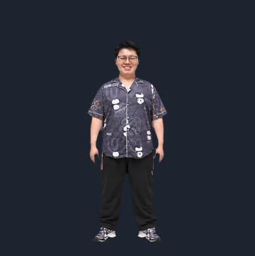
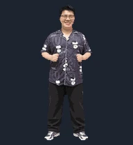
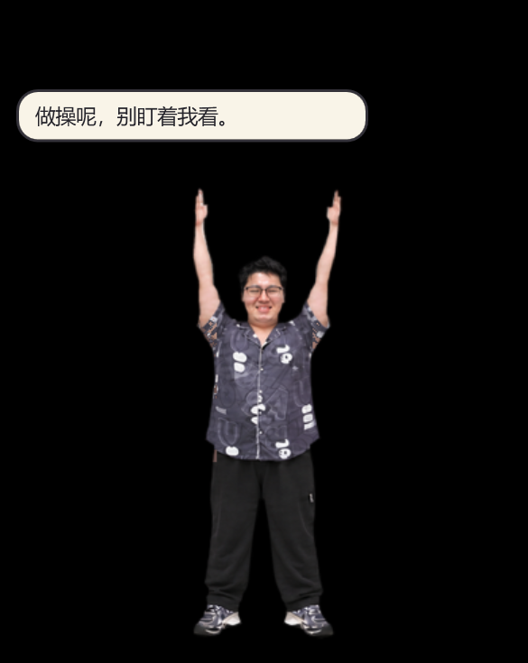

<p align="center">
  
</p>

<h1 align="center">胖宝宝独立桌宠</h1>

<p align="center">一位本该休息的舍友，开始在你的 Windows 桌面认真做广播体操。<br />他会伸展、转体、踮脚，偶尔还会突然开口说话。</p>

<p align="center">
  <a href="https://github.com/Left-William/pangbaobao-desktop-pet/releases/latest">⬇️ 下载桌宠</a>
  · <a href="#先看节目再请上桌">🎬 看动作</a>
  · <a href="#三分钟上桌">🚀 安装</a>
  · <a href="工程验证记录.md">🔬 看验证记录</a>
  · <a href="docs/工程规划.md">📐 看工程规划</a>
</p>

> **桌面健康提示**：他做操的目的暂时不明，但你确实已经坐太久了。

## 这是什么情况

这是一个**独立 Windows 桌面程序**。人物以透明窗口悬浮在桌面上，可以拖动、缩放、置顶；默认循环播放六节广播体操。右键可以固定某一节，也能让他暂停。系统托盘里有设置和退出入口。

人物参考了用户提供的舍友照片，保留眼镜、发型、脸部特征和深色印花睡衣。当前版本是 **0.2.0 功能版**：伸展、转体、踮脚已有 24 FPS 补帧动作；扩胸、体前屈、侧弯仍是低帧数预览素材。

### 他的日程安排

| 节目 | 播放帧 | 桌面观察报告 |
| :--- | ---: | :--- |
| 伸展 | 36 帧 · 24 FPS | 双手缓慢升天，工位气压略有变化 |
| 扩胸 | 6 帧 | 对着空气办了一张健身卡 |
| 体前屈 | 6 帧 | 试图确认地板是否仍在原位 |
| 转体 | 24 帧 · 24 FPS | 检查你有没有偷偷摸鱼 |
| 踮脚 | 20 帧 · 24 FPS | 临时申请增加一点身高 |
| 侧弯 | 6 帧 | 与地心引力进行友好协商 |

伸展、转体、踮脚各有一套**原版对照动作**，可在右键菜单中单独循环；默认整套广播体操只播放上表六节。

## 先看节目，再请上桌

<p align="center">
  
  
  
</p>

补帧用的是离线 RIFE。伸展先制作了七张逐步抬手的关键姿势，再补出过渡帧；转体和踮脚则从原有动作帧补出中间状态。**24 FPS 是播放帧率，不代表每一帧都由人工逐张绘制。** 快速抬手、转头或踮脚时，个别过渡帧仍可能有纹理变化。

## 他什么时候开口

他会不定时弹出对话气泡，文案由你设置。默认台词包括：

> 做操呢，别盯着我看。
>
> 你也起来活动两下。
>
> 先别吵，正在扩胸。

右键点击人物，进入 **「设置对话气泡…」**，可以增删文案、逐条启停、调整判定间隔、出现概率、冷却时间和停留时间。默认每 **300 秒**判定一次，命中概率 **20%**，气泡显示 **5 秒**，消失后冷却 **600 秒**。把概率设为 **0%** 可关闭随机气泡；设为 **100%** 仍受冷却限制。双击人物或选择 **「预览一条气泡」** 可以立即看一条。

<p align="center"></p>

设置保存在 `%APPDATA%\PangBaoBaoPet\settings.json`，更新时保留 `.bak` 备份。需要便携配置时，可在启动前设置环境变量 `PANGBAOBAO_CONFIG_DIR`，指向可写目录。程序不要求登录账号。

## 三分钟上桌

1. 从 [Releases](https://github.com/Left-William/pangbaobao-desktop-pet/releases/latest) 下载 `胖宝宝独立桌宠-0.2.0.zip`，解压整个文件夹。
2. 安装 [Microsoft .NET 8 Desktop Runtime](https://dotnet.microsoft.com/download/dotnet/8.0)（Windows 10/11 x64）。
3. 双击 `PangBaoBaoPet.exe`。左键拖动人物；右键选择动作、速度、缩放、置顶、气泡设置和退出。

没有看到人时，检查系统托盘中的 **「胖宝宝桌宠」→「显示桌宠」**。桌宠的 EXE 与 `Assets` 文件夹需要保持在一起。当前 ZIP 是依赖 .NET 8 Desktop Runtime 的版本，尚未提供自包含安装包。详细步骤见 [安装说明](docs/安装说明.md)。

## 给想拆开看的人

项目使用 .NET 8 WPF / WinForms 实现透明桌面窗口、托盘和设置界面。运行时没有第三方 NuGet 依赖，也不运行 RIFE；RIFE 只在离线制作素材时使用。

```text
PangBaoBaoPet/                  桌面程序、动作播放器、气泡设置与素材
PangBaoBaoPet.SmokeTests/       气泡规则与配置恢复的轻量测试
source-assets/                  旧版原帧、伸展关键姿势
repair_matte.py                 清理白边和紫色抠图残边
build_smooth_stretch.py         组装伸展补帧循环
trial_small_action_rife.py      转体、踮脚的离线补帧脚本
install_refined_assets.py       安装清边和补帧后的动作素材
工程验证记录.md                  本机验证证据和未完成项
```

安装 .NET 8 SDK 后，在仓库根目录执行：

```powershell
dotnet run --project PangBaoBaoPet.SmokeTests/PangBaoBaoPet.SmokeTests.csproj -c Release
dotnet publish PangBaoBaoPet/PangBaoBaoPet.csproj -c Release --self-contained false -o dist/PangBaoBaoPet-0.2.0
```

`prepare_assets.py` 是早期从本机预览文件提取素材的脚本；仓库内已经附有当前运行所需的全部动作帧，正常构建**无需执行**它。发布包内共 122 张播放帧。更多测试范围与限制见 [工程验证记录](工程验证记录.md)。

## 目前的真实进度

- 伸展、转体、踮脚已补帧并接入；扩胸、体前屈、侧弯仍为 5–6 帧。
- 旧素材的紫色残边已清理，白色半透明边缘已减轻；不同动作的清晰度和纹理仍不完全一致。
- 本机完成构建、气泡规则测试、桌面显示与从全新 ZIP 解压目录启动验证。其他电脑、多显示器和 DPI 组合尚待验证。
- 素材包含可辨认的人物肖像。请尊重照片人物，不要擅自挪用或再发布其形象。本仓库暂未附通用开源许可证。

---

<p align="center"><strong>他已经开始做操了。你呢？</strong><br /><sub>如果他突然骂你，记得先检查是不是你自己写的气泡文案。</sub></p>
