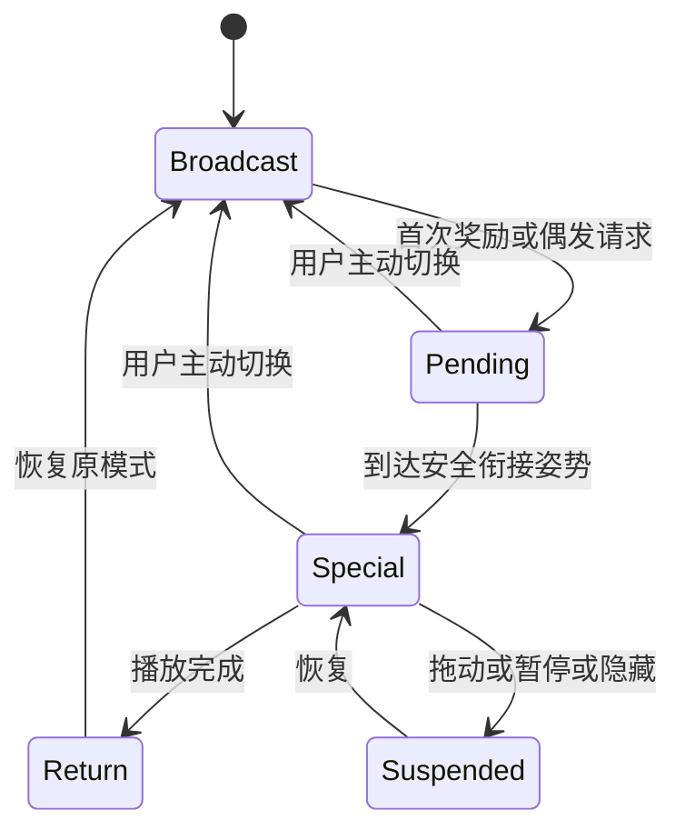

# 胖宝宝独立桌宠：0.3 互动与动画改造工程规划

日期：2026-09-24
状态：**原始规划；已开始实施，进展见 [0.3 实施记录](0.3-实施记录.md)**
基线：独立 Windows 桌面端 v0.2.0；实施版本为 v0.3.0-preview.1。

本文件保留最初的需求、设计建议、实施顺序和验收标准。文中“建议”“计划”保持原规划语义；完成情况和与计划的差异以实施记录为准。

## 1. 本轮目标与边界

### 用户已经明确的要求

1. 气泡像角色本人正在说话，采用漫画对白形式。
2. 增加好感度；点击、拖动等互动可以提升好感度。
3. 达到一定好感度触发飞吻、打滚等特殊动作。
4. 修正 v0.2 动作过于平滑、显得诡异的问题，允许延长动画时长。
5. 保留独立桌面端，以广播体操为主，保持真人辨识度。

### 本规划提出的默认方案

- 继续使用现有 .NET 8 / WPF 桌面应用，复用透明窗口、托盘、设置与逐帧播放器。
- 漫画气泡使用 WPF 图形与文本排版；好感度、事件调度采用小型明确状态机。
- 动画优先重新安排关键姿势与停顿，逐帧剔除不自然的插值，不以更高帧数作为验收目标。
- 好感度暂定 0～100，无自然衰减；30 解锁飞吻，70 解锁打滚。所有数值都是待体验验证的建议值。
- 不引入在线大模型、账号、服务器、复杂养成资源或新桌宠引擎。

## 2. v0.2 现状与问题依据

以下为本地代码和动作配置的静态核对结果；当前没有重新启动程序做视觉验收。

| 部分 | 当前行为 | 本轮需要补齐 |
| --- | --- | --- |
| 气泡布局 | 窗口顶部固定行中的圆角矩形，无尾巴 | 指向角色的尾巴、头部锚点、自适应布局 |
| 文本 | 固定最大高度、自动换行 | 长文本完整展示、角色口吻和事件语境 |
| 随机对白 | 检查间隔、出现概率、冷却、可编辑台词 | 保留能力，区分随机、互动和特殊动作对白 |
| 点击拖动 | 鼠标按下直接 `DragMove()`；双击预览台词 | 点击与拖动分类、有效互动去重、计分规则 |
| 动画 | 按累计时间选帧、循环；自动依次切换广播操 | 单次特殊动作、完成回调、优先级与返回路径 |
| 数据 | `settings.json` 保存偏好 | 独立好感度存档、解锁和首次奖励状态 |

主要代码依据：

- [窗口布局](../PangBaoBaoPet/MainWindow.xaml)
- [窗口交互与播放调度](../PangBaoBaoPet/MainWindow.xaml.cs)
- [动作加载与帧时长](../PangBaoBaoPet/AnimationCatalog.cs)
- [设置与存储](../PangBaoBaoPet/AppSettings.cs)
- [随机气泡调度](../PangBaoBaoPet/BubbleScheduler.cs)
- [当前动作配置](../PangBaoBaoPet/Assets/actions.json)
- [历史验证记录](../工程验证记录.md)

### 默认动画节奏

按当前配置、速度 1×、每段播放一轮计算，不含调度误差：

| 动作 | 帧配置 | 一轮时长 |
| --- | --- | ---: |
| 伸展 | 36 帧 / 24 fps | 1.50 秒 |
| 扩胸 | 6 帧、逐帧时长 | 1.01 秒 |
| 体前屈 | 6 帧、逐帧时长 | 0.82 秒 |
| 转体 | 24 帧 / 24 fps | 1.00 秒 |
| 踮脚 | 20 帧 / 24 fps | 约 0.83 秒 |
| 侧弯 | 6 帧、逐帧时长 | 1.10 秒 |

六段合计约 **6.26 秒**。节奏短促是配置中可确认的问题；脸部漂移、衣纹融化、手部重影等是否出现、出现在哪些帧，仍需后续逐帧检查。不能仅凭帧数判定原因。

## 3. 漫画对白系统

### 3.1 视觉与定位

- 使用浅色实心气泡、深色轮廓、自然圆角和三角或弧形尾巴；默认不使用夸张萌系贴纸。
- 尾巴指向嘴部附近或头部侧边，气泡主体放在头部左上或右上，保留与脸部的空隙。
- 主体与尾巴共用外轮廓，消除尾巴根部的叠线；文本和尾巴不重叠。
- 为每个动作提供归一化 `headAnchor`，必要时在关键帧提供覆盖值。坐标基于素材画布，经过实际图像缩放和留白偏移转换到窗口坐标。
- 锚点只做小幅位置缓冲，避免每一帧追逐脸部导致气泡抖动。拖动时主体与角色共同移动。
- 根据当前显示器工作区选择左右方向；空间不足时向内移动气泡、缩短尾巴。跨屏、缩放和 DPI 变化后重新计算。
- 保持脚底或角色世界锚点稳定，不能为了给气泡腾位置而让角色跳动。
- 伸展时优先避开手臂；打滚中难以稳定指向头部时，把对白安排在起势或结束姿势，不让尾巴穿过身体。
- 透明窗口扩展后，空白区域不得成为大片拦截桌面点击的区域。

### 3.2 台词与排版

- 保留用户可编辑、逐条启用和禁用的台词列表。
- 默认采用简短第一人称、室友聊天口吻；示例仅用于设计：
  - 广播操：“看啥，你也起来伸伸胳膊。”
  - 拖动结束：“放这儿是吧？行，我接着练。”
  - 飞吻结束：“给你一个，别耽误我做操。”
  - 打滚结束：“看完了？扶我起来继续。”
- 不推断真人实际会说什么，不加入未经要求的语音合成。
- 旧台词默认归为通用台词；新增可选语境：通用、点击、拖动结束、飞吻、打滚，以及好感度区间。
- 根据实际文字测量气泡大小，设置合理最大宽度。短句一屏展示；超长内容按测量结果分页，自动轮换，最后一页结束才消失，禁止静默裁切。
- 显示时长仍可设置，分页时每页使用该时长；允许点击关闭。编辑界面显示长文本分页预览。

### 3.3 触发与仲裁

| 来源 | 触发方式 | 概率与频率 |
| --- | --- | --- |
| 随机对白 | 现有定时检查 | 沿用现有出现概率、检查间隔和冷却 |
| 互动对白 | 有效点击或拖动结束 | 独立开关；建议 25% 概率、至少间隔 20 秒 |
| 首次解锁对白 | 特殊动作的说话时点 | 首次奖励附带一句；无合适台词则只播动作 |
| 手动预览 | 用户明确点击预览 | 不计分，不受随机概率影响 |

- 气泡自动显示总开关控制所有自动对白；关闭后首次解锁动作仍可播放。手动预览可显示，以便编辑调试。
- 同时最多一个气泡。首次解锁对白优先于互动对白，互动对白优先于随机对白。
- 高优先级消息可替换低优先级消息；低优先级消息不打断现有消息，不无限排队。
- 自动对白结束或被替换后更新相应冷却，防止紧接着再冒一句随机台词。
- 暂停或隐藏时不产生自动对白；恢复后丢弃已过时的普通互动消息。

## 4. 好感度与互动规则

### 4.1 建议初始参数

| 项目 | 建议值 | 意图 |
| --- | ---: | --- |
| 范围 / 初始值 | 0～100 / 0 | 简单可理解 |
| 有效点击 | +1，计分冷却 3 秒 | 避免连点刷分 |
| 有效拖动 | +2，计分冷却 10 秒 | 鼓励真实移动 |
| 滚动 60 秒总上限 | +6 | 同时约束点击和拖动 |
| 飞吻首次解锁 | 30 | 早期可以体验 |
| 打滚首次解锁 | 70 | 保留后续目标 |
| 解锁后偶发特殊动作 | 有效互动后 10% | 控制频率 |
| 特殊动作全局冷却 | 120 秒 | 保持广播体操为主体 |

这些数值应配置化供后续调试，不需要第一版向用户暴露全部参数。好感度达到上限后互动仍可触发已解锁动作，但不继续加分。没有每日签到、离线扣分或好感度衰减。

### 4.2 手势分类与计分

1. 鼠标按下记录起点，移动超过系统拖动阈值才进入拖动态，继续复用 WPF 拖动能力。
2. 未达到拖动阈值且正常松开，视为点击候选；使用系统双击时间与距离进行归并。
3. 双击保持预览台词的现有用途，并且整组手势最多计一次点击分，不能计两次点击再额外计预览。
4. 拖动完成且实际位置发生有效变化，只计一次拖动分；不再附加点击分，移动过程不逐帧加分。
5. 取消、丢失鼠标捕获、异常退出的手势不计分；点击气泡、菜单、设置、程序自动归位不计分。
6. 暂停时允许移动和设置操作，但不加分、不触发特殊动作；隐藏时不接收互动奖励。
7. 冷却、短时上限和全局节流共同检查，通过后生成一个唯一互动事件供计分、对白和动画使用。

### 4.3 反馈与存档

- 右键菜单显示“好感度 32 / 100”；设置页显示当前值、已解锁动作与下一目标。
- 成功加分可在角色旁短暂显示小型 `+1` / `+2`，合并短时重复反馈，不遮挡脸部和气泡。
- 好感度独立保存到配置目录的 `pet-state.json`，不混入可被设置对话框整份替换的对象。
- 存档包含版本、分数、解锁集合、首次奖励已完成集合、待播放奖励、冷却与限额记录。
- 区分“达到门槛已解锁”与“首次动作已经播放完成”；首次奖励完成时才标记已消费。
- 文件写入采用临时文件、原子替换和备份恢复，复用现有存储方式；普通加分合并写入，解锁及退出时及时保存，禁止每次鼠标移动写盘。
- 新装或旧版升级没有该文件时初始化为 0；普通设置和用户台词保留。坏档优先恢复备份，失败后提示恢复初始值，不能使主程序崩溃。
- 重启后保留剩余冷却与短时限额；运行期间用单调计时，持久化时间异常时采取有界保守值，避免系统时间变化造成永久锁定。
- 用户可以关闭好感度增长，保留已有数值；重置进度是单独操作，界面明确说明会清除解锁和首次奖励记录。

## 5. 特殊动作与播放调度

### 5.1 动作内容

| 动作 | 建议分段 | 时长目标 | 素材要求 |
| --- | --- | --- | --- |
| 飞吻 | 收势站稳 → 抬手靠近嘴部 → 向外送出 → 回落 | 约 3～4 秒 | 真实手臂轨迹、手嘴关系明确，可少量爱心点缀 |
| 打滚 | 蹲下 → 侧身落地 → 翻滚 → 起身站稳 | 约 5～7 秒 | 新姿势素材、可信身体重心和脚底落点 |

两组动作当前素材库尚不具备，需要单独制作关键姿势和过渡。飞吻不能只在站姿上叠爱心；打滚不能仅旋转整张站姿图片。保持眼镜、发型、脸型、体型、衣服花纹及手臂比例，不改成幼态卡通。

打滚制作难度更高，应先审阅关键姿势分镜，再做时间轴。若形体与身份稳定性不达标，保持未完成状态，不用失真的动作代替验收。

### 5.2 一次性播放与恢复

- 动作配置增加用途、播放方式、准备状态、衔接姿势与锚点等元数据，兼容现有动作。
- 一次性动作需要明确的完成事件；现有 `FrameAt()` 取模不能用来判断特殊动作完成。
- 正常自动广播操到达可衔接的收势后播放奖励；手动循环也需记录原动作并在结束后恢复。
- 临时特殊动作不得写入当前设置的 `ActionId`。现有 `SetAction()` 同时修改偏好，应在实现中分离“用户选择”与“临时播放”。
- 特殊动作结束进入站稳过渡，再回到此前模式；自动模式从约定的下一段起势开始，手动模式从原动作安全起点开始。
- 用户主动换动作优先：取消当前临时播放并执行选择。未完成的首次奖励保留待播，不标记完成；偶发奖励可直接丢弃。
- 拖动开始时冻结特殊动作，释放后继续，取消手势也要恢复，避免拖动中继续翻滚；不重复入队当前动作。
- 暂停或隐藏冻结播放进度，恢复后继续，不能因累计真实时间跳到末帧。休眠恢复遵循相同原则。

### 5.3 解锁与优先级

- 首次跨过门槛产生一次奖励；达到门槛时隐藏或暂停，保存请求，恢复后再安排。
- 一次跨过多个门槛时按门槛顺序排队，两个奖励之间至少完整播放一段广播操，不连续堆叠表演。
- 首次奖励优先于偶发奖励；同一奖励只能存在一个待播实例。
- 首次奖励不受随机概率影响；首个奖励可不受偶发冷却限制，但同批后续奖励仍需广播操间隔。
- 已完成首次奖励后，只有新的有效互动事件可以抽取偶发动作，不能在定时器内不断检查“分数大于门槛”触发。
- 仅对已解锁且素材就绪的动作抽取；播放器忙时丢弃偶发请求，不保存过时的长队列。
- 素材缺失或解码失败时跳过特殊播放、保留首次奖励待播，并提示具体动作不可用，广播操继续运行。

## 6. 广播体操自然度改造

### 6.1 改造原则

将以下三件事分别调整：

1. **总时长**：一个动作有足够的起势、发力、到位、回收时间。
2. **帧间节奏**：关键姿势有停顿，过渡有快慢；不均匀分配每一帧时长。
3. **图像一致性**：脸、手指、眼镜、衣纹不随插值发生漂移或融合。

保留现有 16ms 调度与基于时间选帧的实现基础。调度频率、素材帧数和动作时长互相独立；不通过降低 UI 刷新频率制造卡顿，也不把速度滑块调低当成全部修复。

### 6.2 第一组样例

先选伸展制作三组相同显示尺寸的对照：

- A：v0.2 原样，作为问题基线。
- B：保留筛选后的帧，延长时长并增加到位停顿，验证节奏变化。
- C：关键姿势主导，剔除不自然插值，只保留必要的短距离过渡，单独设置帧时长。

C 组可先尝试每秒约 10～15 次姿势更新，但不设为硬指标；静止保持期间不需要生成重复图片。样例先试约 3.5 秒一轮：起势 0.4 秒、展开 1.0 秒、到位 0.5 秒、回收 1.1 秒、站稳 0.5 秒，再按视觉效果调整。

**后续实施到此必须给用户看样例并取得自然度方向反馈，才批量重做其余动作。** 该视觉确认是未来工程阶段，不在本次文档交付中进行。

### 6.3 其余动作建议范围

| 动作 | 单轮建议时长 | 重点 |
| --- | --- | --- |
| 伸展 | 3～4.5 秒 | 手臂长度稳定、到位停顿 |
| 扩胸 | 3～4 秒 | 肩肘带动、不像图片缩放 |
| 体前屈 | 3.5～5 秒 | 下压与起身重心一致 |
| 转体 | 3～4.5 秒 | 头肩腰协调，衣纹不融化 |
| 踮脚 | 2.5～4 秒 | 脚底接地、落下有缓冲 |
| 侧弯 | 3.5～5 秒 | 腰部弯曲可信、回正不弹跳 |

六段一轮目标约 20～30 秒，最终以样例验收为准。默认 1× 使用新节奏，原有速度选项保留供个人调整。

### 6.4 素材处理与质量约束

- 保留原素材与 v0.2 对照，派生新版本目录和清单，支持回退。
- 先检查真实关键姿势，再决定是否需要补帧。现有离线补帧工具只用于幅度小、遮挡简单的过渡。
- 不对跨度很大的姿势盲目补帧；手遮脸、转身、翻滚等复杂遮挡优先补画中间关键姿势。
- 去除脸部熔化、手臂拉伸、双影和衣纹游动帧；必要时宁可明确切换姿势并停留，也不保留失真的过渡。
- 回程检查独立的人体节奏，不能默认正向序列倒放就自然。
- 同一动作统一脚底位置、人物比例和画布；动作之间统一站姿衔接，避免现在不同显示高度引入的视觉跳变。
- 黑、白、中灰背景分别检查透明边缘；抬手、蹲下、翻滚全程检查裁切和白边。
- 打滚可能超过当前窗口和图像区域，按动作边界扩展临时画布，保持世界坐标落点稳定，并在显示器边缘向可用方向选择翻滚位置。

## 7. 工程拆分与兼容性

以下名称为建议职责划分，实现时按实际复杂度合并，避免无必要的框架化。

| 位置或模块 | 计划职责 |
| --- | --- |
| `MainWindow.xaml` | 漫画气泡、好感度反馈、动态显示区域 |
| `MainWindow.xaml.cs` | 接线、窗口定位与生命周期，逐步移出独立业务规则 |
| `SpeechBubble` / `BubbleLayout` | 尾巴轮廓、文本测量、分页、锚点和避让 |
| `BubbleScheduler` | 保留随机调度，接入来源和优先级 |
| `InteractionTracker` | 单击双击拖动识别、一次手势一个事件 |
| `AffectionService` / `PetStateStore` | 计分、门槛、限流、持久化和恢复 |
| `AnimationController` | 循环与一次性播放、暂停、队列、过渡和返回 |
| `AnimationCatalog` | 新元数据及素材校验，兼容旧配置 |
| 设置窗口与 `AppSettings` | 自动对白与好感度开关、进度展示、兼容旧台词 |
| `Assets/actions.json` 与帧目录 | 新节奏、锚点、飞吻和打滚素材 |

配置加载必须检查：帧数量与声明一致、时长为正、逐帧时长数组长度匹配、锚点坐标合法、一次性动作具备完成路径。旧配置可由兼容层转换，不能无提示地改变旧数据含义。

运行时不引入视频生成、补帧计算或联网依赖。复用成熟离线工具制作素材，继续以透明 PNG 序列播放。大体积特殊动作按需加载或设缓存上限，避免启动时无边界预加载。

## 8. 实施阶段与交付门槛

| 阶段 | 工作 | 通过标准 |
| --- | --- | --- |
| P0 基线记录 | 记录 v0.2 默认速度预览、截图、内存和素材清单 | 可以准确对照、可以回退 |
| P1 动画方向样例 | 完成伸展 A/B/C 对照及飞吻、打滚关键姿势分镜 | 用户确认自然度、辨识度和动作方向 |
| P2 漫画对白 | 完成尾巴、锚点、分页、概率兼容和优先级 | 看得出是谁在说话，不遮脸、不出屏 |
| P3 好感度逻辑 | 手势分类、计分、门槛、存档与展示 | 去重、限流、重启恢复正确 |
| P4 特殊动作接入 | 一次性播放、奖励队列、暂停及返回 | 飞吻和打滚可完整触发，返回广播操 |
| P5 全套节奏改造 | 将认可方向推广到其余广播操，检查透明边缘 | 默认速度自然、动作切换不跳变 |
| P6 验收与候选包 | 完成场景验证、升级回归、使用说明和候选包 | 满足下列验收项，记录尚存问题 |

P2 与 P3 的代码工作可以独立推进；P4 依赖经确认的素材方向和 P3。正式发布是后续单独阶段，此文件不授权立即执行或上传。

## 9. 验收清单

### 对白与显示

- [ ] 常见动作下尾巴指向角色头部附近，主体不遮脸，轮廓没有接缝。
- [ ] 长句、中文标点、多行和空内容处理明确，分页没有丢字或裁字。
- [ ] 75%、100%、150% 缩放、不同 DPI、四角和跨显示器拖动布局正确。
- [ ] 自动对白关闭后不弹自动台词；随机概率 0% 不触发、100% 在满足间隔和冷却时触发。
- [ ] 特殊动作对白不会与随机气泡叠在一起；空台词列表不影响动作。

### 好感度与状态

- [ ] 单击、双击、微小移动、有效拖动、取消拖动各有确定结果，无重复计分。
- [ ] 连点、连续拖动受冷却与滚动上限约束；气泡点击、菜单操作不加分。
- [ ] 29→30、69→70 各触发一次首次奖励；停留在门槛以上不会反复触发。
- [ ] 同次跨越多个门槛按顺序播放；重启不会重复已完成奖励，也不丢失待播奖励。
- [ ] 满值仍可触发已解锁偶发动作；关闭增长、重置和坏档恢复行为符合设置说明。
- [ ] 暂停、隐藏、休眠恢复没有补发一串过期气泡或分数。

### 动画与交互

- [ ] 默认 1× 下与 v0.2 并排比较，用户认可节奏和自然度。
- [ ] 人脸、眼镜、手臂长度和衣服图案稳定，无明显融化、拉伸、双影。
- [ ] 飞吻有完整手嘴动作；打滚有蹲下、翻滚和起身，身体未裁切、脚底不漂移。
- [ ] 特殊动作期间拖动、暂停、主动换动作均能退出或恢复，无卡死和意外循环。
- [ ] 特殊动作结束恢复原模式，偏好中的手动动作没有被临时动作覆盖。
- [ ] 三种背景下透明边缘合格，窗口扩大后不挡住大片桌面操作区域。

### 工程验证方式

- 对手势去重、冷却、门槛、队列和存档迁移编写确定性测试，使用可控时钟与随机源。
- 对动作清单做自动校验：帧数、时长、文件存在、画布与锚点。
- 视觉问题以真人大小的实际桌面预览、逐帧对照和用户反馈验收，自动测试不能替代。
- 在同一机器、显示尺寸和速度下对照 v0.2，记录启动耗时、稳定内存、CPU 与拖动响应；如有明显回退，查明原因后再封装，不虚构性能指标。
- 验证旧版设置与台词升级保留、首次启动初始化、坏档恢复，以及正常退出后的重启。

## 10. 后续交付物与回退

后续工程完成时应包含：

1. 可独立运行的 Windows 候选包和版本说明。
2. 新旧动画对照预览、关键姿势分镜和透明边缘检查图。
3. 漫画气泡、好感度、解锁动作的设置说明。
4. 自动测试结果、人工场景验收记录，以及用户确认的视觉方向。
5. 素材来源与派生关系清单、配置迁移说明和已知限制。

升级前备份设置与存档；新素材和配置保留版本标识。回退程序时恢复匹配的设置备份，好感度文件单独保留，禁止旧版本覆盖不认识的新存档。v0.2 包与原始素材继续保留作对照。

**本文件是规划快照，不作为当前完成情况证明。** 实际状态与验证结果见 [0.3 实施记录](0.3-实施记录.md)。
